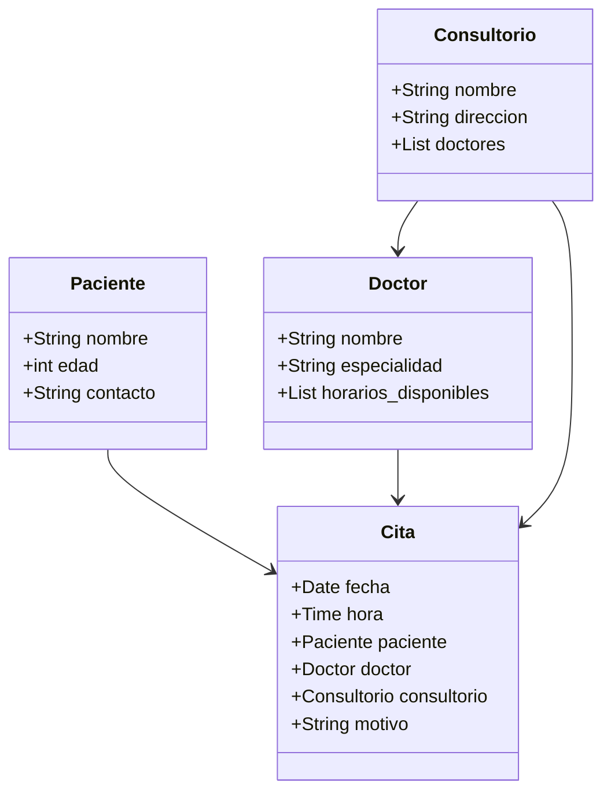

# Actividad 1.2 – Creación de Repositorio en GitHub (Trabajo en Equipo)

**Integrantes:**

- Apodaca Ramírez josé Daniel - 23030500

- Kumagai Mendoza Yosichi - 23030674

- Vargas Medina Josué - 23030151

# Proyecto: Sistema de Reservaciones de Consultorio Médico

Descripción del proyecto: Se desarrollará una API para gestionar las citas en un consultorio médico. Las funcionalidades principales incluyen:

Operaciones CRUD para pacientes (nombre, edad, datos de contacto, historial médico básico).

Operaciones CRUD para doctores (especialidad, horario).

Sistema de reservaciones: un paciente puede agendar una cita con un doctor en un horario específico.

Validación de conflictos de horario.

Consulta de citas pasadas y futuras.

Implementación en SQLite3 con relaciones.

# Instalación de entorno virtual

Microsoft Windows [Versión 10.0.19045.5247]
(c) Microsoft Corporation. Todos los derechos reservados.

C:\Users\01>cd Desktop

C:\Users\01\Desktop>cd Proyectos

C:\Users\01\Desktop\Proyectos>cd equipo2-consultorio

C:\Users\01\Desktop\Proyectos\equipo2-consultorio>cd equipo2-consultorio-main

C:\Users\01\Desktop\Proyectos\equipo2-consultorio\equipo2-consultorio-main>python -m venv .venv

C:\Users\01\Desktop\Proyectos\equipo2-consultorio\equipo2-consultorio-main>.venv\Scripts\activate

(.venv) C:\Users\01\Desktop\Proyectos\equipo2-consultorio\equipo2-consultorio-main>pip install flask
Collecting flask
Downloading flask-3.1.2-py3-none-any.whl.metadata (3.2 kB)
Collecting blinker>=1.9.0 (from flask)
Downloading blinker-1.9.0-py3-none-any.whl.metadata (1.6 kB)
Collecting click>=8.1.3 (from flask)
Downloading click-8.3.0-py3-none-any.whl.metadata (2.6 kB)
Collecting itsdangerous>=2.2.0 (from flask)
Downloading itsdangerous-2.2.0-py3-none-any.whl.metadata (1.9 kB)
Collecting jinja2>=3.1.2 (from flask)
Downloading jinja2-3.1.6-py3-none-any.whl.metadata (2.9 kB)
Collecting markupsafe>=2.1.1 (from flask)
Downloading MarkupSafe-3.0.2-cp313-cp313-win_amd64.whl.metadata (4.1 kB)
Collecting werkzeug>=3.1.0 (from flask)
Downloading werkzeug-3.1.3-py3-none-any.whl.metadata (3.7 kB)
Collecting colorama (from click>=8.1.3->flask)
Downloading colorama-0.4.6-py2.py3-none-any.whl.metadata (17 kB)
Downloading flask-3.1.2-py3-none-any.whl (103 kB)
Downloading blinker-1.9.0-py3-none-any.whl (8.5 kB)
Downloading click-8.3.0-py3-none-any.whl (107 kB)
Downloading itsdangerous-2.2.0-py3-none-any.whl (16 kB)
Downloading jinja2-3.1.6-py3-none-any.whl (134 kB)
Downloading MarkupSafe-3.0.2-cp313-cp313-win_amd64.whl (15 kB)
Downloading werkzeug-3.1.3-py3-none-any.whl (224 kB)
Downloading colorama-0.4.6-py2.py3-none-any.whl (25 kB)
Installing collected packages: markupsafe, itsdangerous, colorama, blinker, werkzeug, jinja2, click, flask
Successfully installed blinker-1.9.0 click-8.3.0 colorama-0.4.6 flask-3.1.2 itsdangerous-2.2.0 jinja2-3.1.6 markupsafe-3.0.2 werkzeug-3.1.3

[notice] A new release of pip is available: 24.2 -> 25.2
[notice] To update, run: python.exe -m pip install --upgrade pip

(.venv) C:\Users\01\Desktop\Proyectos\equipo2-consultorio\equipo2-consultorio-main>pip freeze > requirements.txt

(.venv) C:\Users\01\Desktop\Proyectos\equipo2-consultorio\equipo2-consultorio-main>python app.py

- Serving Flask app 'app'
- Debug mode: on
  WARNING: This is a development server. Do not use it in a production deployment. Use a production WSGI server instead.
- Running on http://127.0.0.1:5000
  Press CTRL+C to quit
- Restarting with stat
- Debugger is active!
- Debugger PIN: 273-742-674
  127.0.0.1 - - [26/Sep/2025 21:11:38] "GET / HTTP/1.1" 200 -
  127.0.0.1 - - [26/Sep/2025 21:11:38] "GET /favicon.ico HTTP/1.1" 404 -

  # Repositorio de Referencia:

https://github.com/victorrpt-teacher/tijuamon-api

# Diagrama de clases de Mermaid

